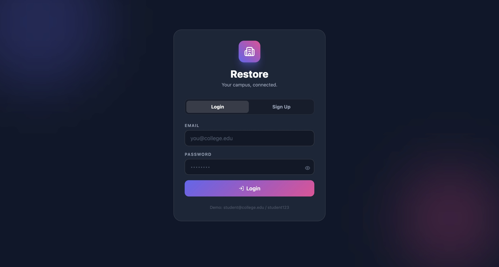
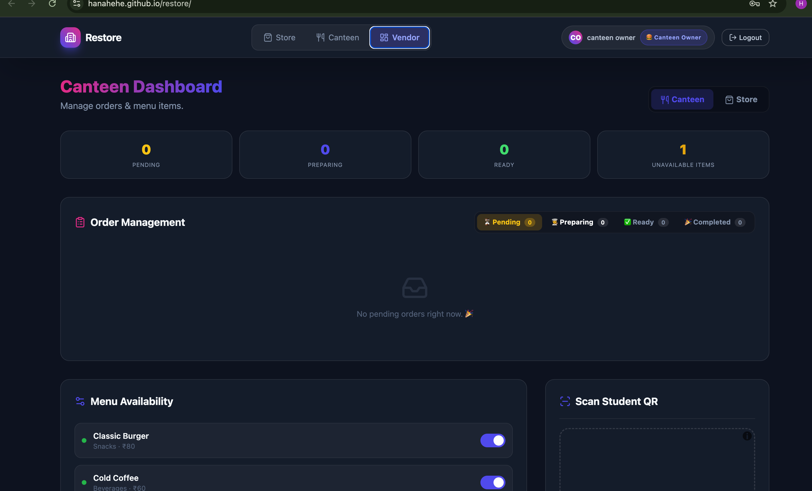
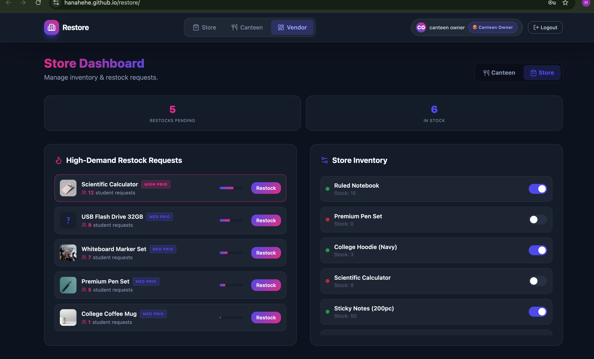

<p align="center">
  
</p>

#RESTORE 🎯

## Basic Details

### Team Name: KERNAL

### Team Members
- Member 1: HANA HARIS - COLLEGE OF ENGINEERING THALASSERY


### Hosted Project Link
https://hanahehe.github.io/restore/

### Project Description
This project is a smart campus logistics platform that streamlines student life by providing real-time inventory tracking for college stores and a pre-booking system for the canteen. It empowers students to influence store restocking through a crowdsourced demand feature and eliminates long food queues via QR-code-based meal collection.

### The Problem statement
This project solves campus logistics friction by eliminating wasted trips for out-of-stock stationery through demand-driven restocking and ending long canteen queues via QR-code pre-booking with peak-hour load balancing.

### The Solution
Crowdsourced Restocking: Enables students to "Request" out-of-stock items, providing vendors with a data-driven replenishment list.

QR-Code Pre-booking: Eliminates canteen queues by shifting ordering to a "grab-and-go" digital system.

Traffic Load Balancing: Uses a Peak Hour Predictor to alert students of high-volume times, ensuring smoother service for both kitchen staff and hungry students.

---

## Technical Details

### Technologies/Components Used

**For Software:**
- Languages used: html,javascript ,css
- Tools used: git,antigravity

---

## Features

List the key features of your project:
- Live Inventory Tracking: Real-time visibility of stationery and college goodies with "In Stock" or "Out of Stock" status.
- Crowdsourced Demand System: A "Request Restock" button for unavailable items that increments a counter, notifying vendors of high-priority needs.
- Canteen Pre-booking: A digital menu allowing students to order food in advance to avoid physical queues.
- Dynamic QR Code Generation: Instant generation of a unique QR code upon order confirmation for secure, contactless pickup.

---

## Implementation

### For Software:

#### Installation
```bash
 git clone https://github.com/hanahehe/restore
 cd restore
```

#### Run
```bash
python3 -m http.server
http://localhost:8000
```
---

## Project Documentation

login interface
<p align="center">
  
</p>


Real-time visibility of stationery and college goodies with "In Stock" or "Out of Stock" status.
<p align="center">
  
</p>
 
A digital menu allowing students to order food in advance to avoid physical queues.
<p align="center">
  
</p>

this is a vendor interface of canteen,where the vendors can see the prebooked food order along with QR code scanner for ending long canteen queues 
<p align="center">
  
</p>

this is a vendor interface of store, where the vendor can see the products in demand
<p align="center">
  
</p>

#### Diagrams

**System Architecture:**

docs/system architechture.png


**Application Workflow:**

docs/workflow.png


---

#### Build Photos


*List out all components shown*


*Explain the build steps*


*Explain the final build*

---


## Project Demo

### Video

https://drive.google.com/file/d/1XmzPi14iu-hp8ad9mH8ePXL8rQmfiCTj/view?usp=sharing
the video demonstrates the user interface ,access to live Inventory Tracking,pre ordering , requesting for outof stock products etc.

### Additional Demos
https://drive.google.com/file/d/11eecBJ6z4tKnsGpiNHLiQaueP1VgkbQU/view?usp=sharing
this is the vendor interface where ,the vendor can see the demand , prebooked orders , time of pickup,

---

## AI Tools Used (Optional - For Transparency Bonus)

If you used AI tools during development, document them here for transparency:

**Tool Used:** [e.g., GitHub Copilot, v0.dev, Cursor, ChatGPT, Claude]

**Purpose:** [What you used it for]
- Example: "Generated boilerplate React components"
- Example: "Debugging assistance for async functions"
- Example: "Code review and optimization suggestions"

**Key Prompts Used:**
- "Create a REST API endpoint for user authentication"
- "Debug this async function that's causing race conditions"
- "Optimize this database query for better performance"

**Percentage of AI-generated code:** [Approximately X%]

**Human Contributions:**
- Architecture design and planning
- Custom business logic implementation
- Integration and testing
- UI/UX design decisions

*Note: Proper documentation of AI usage demonstrates transparency and earns bonus points in evaluation!*

---

## Team Contributions

- hana haris -(individual participant)full stack 

---

## License

This project is licensed under the [LICENSE_NAME] License - see the [LICENSE](LICENSE) file for details.

**Common License Options:**
- MIT License (Permissive, widely used)
- Apache 2.0 (Permissive with patent grant)
- GPL v3 (Copyleft, requires derivative works to be open source)

---

Made with ❤️ at TinkerHub
